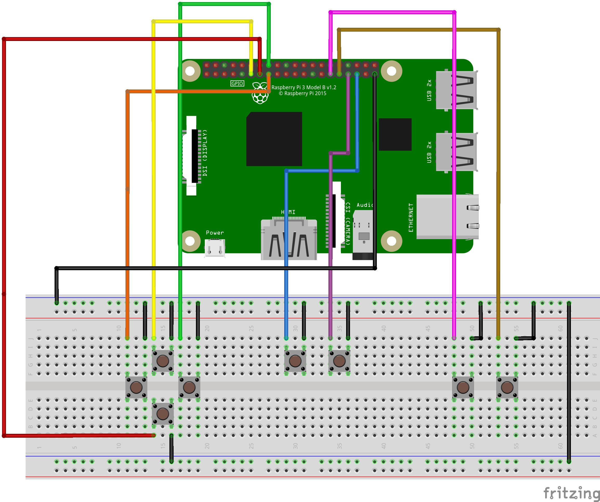

# breadboard-controller

## Wiring Diagram

This diagram shows how the Raspberry Pi GPIO pins are connected to the breadboard buttons.

## Installation Instructions:

### Prerequisites:
sudo apt update

sudo apt install -y gcc build-essential wiringpi

sudo modprobde uinput

echo uinput | sudo tee -a /etc/modules

### Install:
git clone https://github.com/memphisb205/breadboard-controller.git

cd breadboard-controller

make

make install

### Clean Up Build Files:
make clean

### Uninstall:
make uninstall

